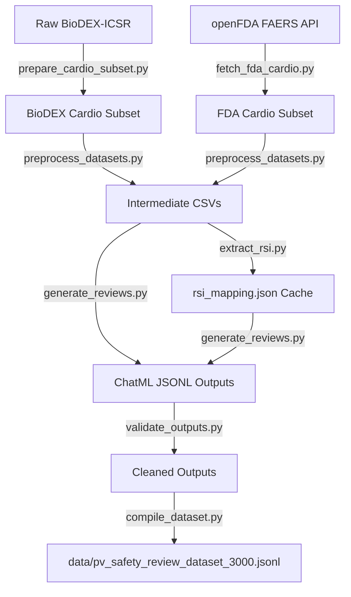

# Pharmacovigilance (PV) Dataset Generation Pipeline: Documentation & Progress Report

This document outlines the full architecture, execution flow, file structures, and internal logic for the Pharmacovigilance Fine-Tuning dataset creator. It is designed to be shared directly with Gemini or other agents to coordinate next steps.

---

## 1. High-Level Architecture Overview

The pipeline's goal is to construct a high-quality, balanced, ChatML-formatted training dataset (`data/pv_safety_review_dataset_3000.jsonl`) consisting of **3,000 cases** for fine-tuning LLMs on Pharmacovigilance (PV) medical reviews. 

The pipeline extracts cardiology adverse event reports, scrapes official Reference Safety Information (RSI) drug labels, queries the Gemini API for clinical assessments (Seriousness, MedDRA PT, Labeling expectedness, Naranjo causality), validates output structure, and balances the dataset with synthetic negatives.



---

## 2. Component & Script Walkthrough

### Stage 1: Data Pre-processing Pipeline (`main.py`)
`main.py` is the orchestrator for stages 1 to 3. It clears the existing `data/` directory and executes:
1. `prepare_cardio_subset.py`
2. `fetch_fda_cardio.py`
3. `preprocess_datasets.py`

#### 1. `scripts/prepare_cardio_subset.py`
* **Purpose**: Filters the BioDEX-ICSR Hugging Face literature dataset for cardiac-related records.
* **Logic**:
  1. Downloads the MeSH hierarchy tree to extract all Descriptor IDs under the **C14 (Cardiovascular Diseases)** branch.
  2. Compiles a refined regular expression targeting specific cardiology terms (e.g., *cardiomyopathy, myocardial, atrial fibrillation, qt prolong*) while using negative lookbehinds to prevent matching false positives like *non-cardiac*.
  3. Merges the Hugging Face BioDEX splits (train/val/test) and filters records matching MeSH C14 or keyword patterns.
  4. Saves results as a local Hugging Face dataset, CSV, and JSONL.
  * **Result**: `data/biodex/raw/cardio_dataset.jsonl` (2,645 rows).

#### 2. `scripts/fetch_fda_cardio.py`
* **Purpose**: Fetches balanced FDA FAERS cardiology adverse event reports via openFDA.
* **Logic**:
  1. Defines **6 clinical categories** (Infarction/Ischemia, Heart Failure, Arrhythmias, Inflammatory/Infectious, Vascular/BP, Structural/Arrest) with specific MedDRA search strings.
  2. Queries the openFDA API to fetch exactly **500 unique records per category** (3,000 total).
  3. De-duplicates report IDs globally to prevent duplicate case files.
  4. Flattens nested JSON payloads to pull patient demographics, seriousness flags, reaction terms, and suspect drugs.
  * **Result**: `data/openfda/raw/fda_cardio_dataset.jsonl` (3,000 total records).

#### 3. `scripts/preprocess_datasets.py`
* **Purpose**: Cleans, refines, and outputs normalized columns for the generation model.
* **Logic**:
  1. For **BioDEX**: Retains `title`, `abstract`, `target` (suspected drug information), `mesh_terms`, and `keywords`.
  2. For **openFDA**: Retains demographics, all seriousness flags, reaction terms, suspect drugs, and category.
  3. Outputs the clean files into subfolders and copies them to the `data/` root folder.
  * **Result**: `data/biodex_cardio_clinical.csv` & `data/fda_cardio_clinical.csv`.

---

### Stage 2: Label Scraper (`scripts/extract_rsi.py`)
* **Purpose**: Builds an offline cache of Reference Safety Information (RSI) for every unique drug.
* **Logic**:
  1. Scans both preprocessed datasets to compile a set of all unique suspect drugs.
  2. Iteratively queries the `https://api.fda.gov/drug/label.json` API with a combined query checking generic name, brand name, and substance name.
  3. Extracts the `boxed_warning`, `warnings_and_cautions`, and `adverse_reactions` sections.
  4. Caches findings in a local dictionary progressively to avoid losing progress in case of interrupts.
  5. Implements API rate limiting (0.25s delay with key; 1.6s delay without).
  * **Result**: `data/rsi_mapping.json` (Caching 1,551 unique drugs).

---

### Stage 3: LLM Safety Review Orchestrator (`generate_reviews.py`)
* **Purpose**: Concurrently queries Gemini API to perform clinical reviews and output structured data.
* **Logic**:
  1. **Thread-Safe Multi-Key Rotation**: Loads multiple API keys from `.env` (`GEMINI_API_KEYS`). It creates a `queue.Queue` of `google.genai.Client` instances, ensuring that threads dynamically request and return a client per query.
  2. **ThreadPool Executor**: Spawns multiple threads (workers = `keys * 2`) to perform queries concurrently.
  3. **Drug-Narrative Primary Suspect Selection**:
     * For BioDEX: Scans the CSV's suspect drugs and prioritizes the one explicitly mentioned in the narrative text.
     * For openFDA: Takes the first listed drug in the semicolon-separated field.
  4. **Dynamic Prompt Context Injection**: Injects the patient narrative, drug name, and the drug's corresponding cached RSI. If the RSI is missing, instructions prompt the LLM to fall back on its internal clinical training database.
  5. **Structured Outputs**: Uses the official `google-genai` SDK with a rigid Pydantic schema (`PVReviewResponse`) to guarantee parseable JSON responses.
  6. **Error / Rate Limit Handling**: Catches 429 errors (ResourceExhausted), sleeps the failing thread for 10 seconds, and retries the request using the same client, allowing other key clients to continue working uninterrupted.
  7. **Resume Capability**: Hashes the patient narrative. Before querying, it reads existing outputs and automatically skips hashed keys to support restarts.
  * **Result**: Appends ChatML JSONL lines to `data/biodex_chatml.jsonl` and `data/fda_chatml.jsonl`.

---

### Stage 4: Post-Generation Quality Control (`scripts/validate_outputs.py`)
* **Purpose**: Prunes malformed or stale records to ensure 100% schema compliance.
* **Logic**:
  1. Programmatically parses the JSONL.
  2. Enforces **strict schema checks**:
     * ChatML alignment (exactly 3 messages: `system`, `user`, `assistant`).
     * System prompt integrity (identifies and prunes stale records from older prompt configurations).
     * Assistant JSON parseability.
     * Required keys presence: `meddra_pt`, `seriousness`, `causality`, `expectedness`.
     * Valid range checks: Naranjo score must reside between `-4` and `+13`, interpretation must belong to `{Definite, Probable, Possible, Doubtful}`, and `is_serious` must be a boolean.
  3. Programmatically deletes flagged lines and rewrites the clean file in place (runs instantly).

---

### Stage 5: Balancer & Final Compiler (`scripts/compile_dataset.py`)
* **Purpose**: Balances and creates the final 3,000-record dataset.
* **Logic**:
  1. Loads all valid records from `data/biodex_chatml.jsonl` and `data/fda_chatml.jsonl`.
  2. Segregates records into three causality categories: **Doubtful**, **Possible**, and **Probable/Definite**.
  3. Attempts to sample **900 records per category** (evenly splitting them between `Expected` and `Unexpected` reactions if possible).
  4. **Synthetic Negative Generation**: Generates **300 negative cases** (100 each) using clinical demographics and drug lists:
     * **Missing Drug**: Narratives with no suspect medication documented.
     * **Missing Event**: Reports where a drug was taken but no adverse event occurred.
     * **Administrative Noise**: Non-clinical inquiries (refund requests, shipping damage, prescription status).
     The assistant responses for these negatives output `meddra_pt: "None"` and `causality.interpretation: "Unassessable - Missing Data"`.
  5. Shuffles all 3,000 selected rows and saves the final file.
  * **Result**: `data/pv_safety_review_dataset_3000.jsonl`

---

## 3. Data Structures & Formats

### User Prompt Construction
The user prompt combines the narrative with the reference drug label (RSI):
```text
Patient Narrative:
A 52 year-old female patient experienced the following adverse events: MYOCARDIAL INFARCTION; CARDIAC ARREST. The suspected drug is LISINOPRIL.

Reference Safety Information (RSI) for LISINOPRIL:
BOXED WARNING:
WARNING: FETODUCTAL TOXICITY...
WARNINGS AND CAUTIONS:
...
ADVERSE REACTIONS:
...
```

### Assistant ChatML Target Response
The assistant response includes a clinical chain-of-thought followed by the structured schema JSON:
```text
The patient experienced a myocardial infarction and cardiac arrest while taking Lisinopril. A review of the Lisinopril RSI confirms that myocardial infarction is listed under adverse reactions, making this event expected. Seriousness is met due to cardiac arrest and myocardial infarction representing life-threatening events. Applying the Naranjo algorithm, the temporal relationship is plausible (+1), but no dechallenge or rechallenge information is present, resulting in a causality score of 1.

```json
{
  "seriousness": {
    "is_serious": true,
    "criteria": "life-threatening"
  },
  "meddra_pt": "Myocardial infarction",
  "expectedness": "Expected",
  "causality": {
    "naranjo_score": 1,
    "interpretation": "Possible"
  }
}
```
```

---

## 4. Current Progress & Statistics

1. **Cardiology Data Preparation**: Complete.
   * BioDEX cardiology subset: **2,645 rows**.
   * openFDA cardiology subset: **3,000 rows**.
2. **RSI Label Cache**: Complete.
   * Successfully cached **1,551 unique drugs** in `data/rsi_mapping.json`.
3. **BioDEX Generation Progress**: **Complete**.
   * Successfully processed all rows; **2,465 valid records** passed validation checks.
4. **openFDA Generation**: **Complete**.
   * Successfully processed all rows; **2,999 valid records** passed validation checks.
5. **Final Balancing and Validation**: **Complete**.
   * Output dataset `data/pv_safety_review_dataset_3000.jsonl` compiled with exactly **3,000 records** (2,700 medical reviews and 300 synthetic negatives).


### Notable Multi-Drug Analysis
A parsing analysis of the pre-processed files showed:
* **74.9% of BioDEX cases** involve multiple drugs.
* **69.7% of openFDA cases** involve multiple drugs.

*Currently, the pipeline selects the primary suspect drug for analysis. In a future iteration, we can configure the orchestrator to expand these rows to evaluate each drug in a multi-drug case independently.*
